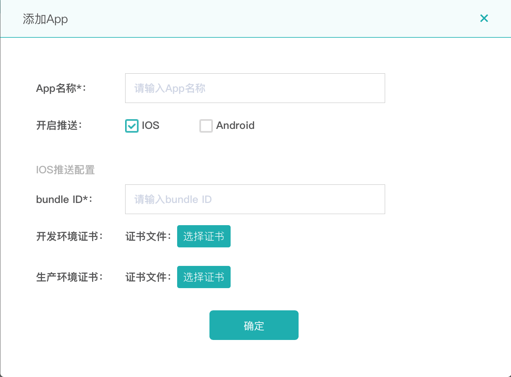



##智齿客服SDK-iOS对接集成文档V2.7.0
[一、集成准备](#一)   
>[1.1 注册AppKey](#1.1)     
[1.2 下载智齿SDK](#1.2)   
[1.3 包文件说明](#1.3)    
[1.4 导入SDK和添加依赖库](#1.4)    
[1.5 使用CocoaPods集成](#1.5)

[二、快速集成](#二)    
>[2.1 快速集成SDK](#2.1)     
[2.2 初始化参数配置](#2.2)   
[2.3 UI配置](#2.3)   
[2.4 推送配置和消息监听](#2.4)   
[2.5 关闭推送](#2.5)   
[2.6 离线消息](#2.6)   
[2.7 未读消息](#2.7)    
[2.8 清空用户下所有未读消息](#2.8)    
[2.9 发送定位信息](#2.9)    
[2.10 推送消息支持来源](#2.10)

[三、详细参数说明](#三)     
>[3.1 ZCLibInitInfo类说明](#3.1)     
[3.2 ZCKitInfo类说明(主要UI相关配置)](#3.2)    
[3.3 ZCProductInfo类说明（商品信息）](#3.3)     
[3.4 ZCLibMessage（消息对象）](#3.4)   
[3.5 ZCLibRich（富媒体消息类）](#3.5)   
[3.6 ZCLibSkillSet类说明(技能组)](#3.6)    
[3.7 请求接口返回状态字段说明](#3.7)    

[四、接口说明](#四)  
>[4.1初始化接口](#4.1)   
[4.2 获取会话编号列表](#4.2)   
[4.3 获取历史记录](#4.3)   
[4.4 转人工](#4.4)   
[4.5 发送消息](#4.5)    
[4.6 获取机器人引导语](#4.6)    
[4.7 提交评价](#4.7)   
[4.8 获取技能组](#4.8)     
[4.9 发送正在输入内容](#4.9)     
[4.10 提交留言](#4.10)    
[4.11 退出SDK](#4.11)    
[4.12 清除历史记录](#4.12)    
[4.13 留言上传图片](#4.13)   
[4.14 机器人顶踩](#4.14)   
[4.15 获取人工客服评价标签](#4.15)  
[4.16 获取留言自定义字段接口](#4.16)   
[4.17 获取机器人热点引导问题](#4.17)  
[4.18 获取联想分词接口](#4.18)  
[4.19 获取机器人列表接口](#4.19)  
[4.20 获取快捷入口标签列表接口](#4.20)    
[4.21  获取平台电商的消息列表接口](#4.21)      
[4.22  商家删除指定商户接口](#4.22)  


[五、常见问题](#五)    
>[5.1 启动后页面直接返回](#5.1)    
[5.2 iOS 10相机、相册、麦克风权限问题](#5.2)    
[5.3 无法正常接收推送消息](#5.3)    
[5.4 没有收到客服发送的消息](#5.4)  
[5.5 IQKeyboardManage键盘问题](#5.5)
[5.6 项目文件集成问题](#5.6)

##<font color=LightSeaGreen size=4>一、集成准备</font> <div id="一"></div>
####1.1注册AppKey<div id="1.1"></div>    
请先确保已注册智齿客服账号<a href="https://www.sobot.com">https://www.sobot.com</a>。
 
####1.2下载智齿SDK<div id="1.2"></div>    
点击下载最新SDK包。
[iOS_SDK](https://github.com/ZCSDK/SobotKit)     

####1.3包文件说明 <div id="1.3"></div>   

解压下载【iOS_SDK】,下载完毕为一个压缩包，包含（<font color=Crimson size=2>SobotKit.framework</font>、<font color=Crimson size=2>SobotKit.bundle</font>)和相关说明文档。 


 
| 文件名	| 说明|  
------------- | ------------  
|<font color=Crimson size=2>SobotKit.framework</font>|	智齿SDK核心代码库|
|<font color=Crimson size=2>SobotKit.bundle</font>|	图片资源文件 表情资源文件 语言文件|
|<font color=Crimson size=2>ZCLibInitInfo.h	</font>|实体类：基础参数类（自定义用户配置信息）|
|<font color=Crimson size=2>ZCKitInfo.h</font>	|实体类：基础参数（UI自定义）|
|<font color=Crimson size=2>ZCSobot.h</font>	|连接客户端到智齿客服，该文件提供接入功能|
|<font color=Crimson size=2>SobotKit.h</font>	|该文件引用所有SDK需要的文件|
|<font color=Crimson size=2>ZCUIBaseController</font>	|UI界面父类，定义顶部View|
|<font color=Crimson size=2>ZCChatController</font>	|添加chatView的管理类|
|<font color=Crimson size=2>ZCChatView</font>	|主要UI界面，如果需要自己实现跳转，可以自己引用实现|
|<font color=Crimson size=2>SobotLocalizable.string</font>|	国际化语言文件|
|<font color=Crimson size=2>ZCLibClient.h</font>	|初始化配置类|

####1.4手动导入SDK和添加依赖库<div id="1.4"></div>
把下载的<font color= orange size=2>SobotKit</font>文件夹中的文件拖入你的工程里。
智齿iOS_SDK 的实现，依赖了一些系统的框架，在开发应用时需要在工程里加入这些框架 ( SobotLib不包含UI界面，可根据接口自行开发功能 ) 。开发者首先点击工程右边的工程名，然后在工程名右边依次选择<font color= orange size=2>TARGETS -> BuiLd Phases -> Link Binary With Libraries</font>，展开 <font color= orange size=2>LinkBinary With Libraries</font> 后点击展开后下面的 + 来添加下面的依赖项:  
 > <font color= orange size=2>AVFoundation.framework</font>  
 > <font color= orange size=2>AssetsLibrary.framework</font>  
 > <font color= orange size=2>AudioToolbox.framework</font>  
 > <font color= orange size=2>SystemConfiguration.framework</font>   
 > <font color= orange    size=2>MobileCoreServices.framework</font>   
 > <font color= orange size=2>libz.1.2.5.tbd( dylib)</font>

####1.5 使用CocoaPods集成<div id="1.5"></div>   
在`Podefile`文件中加入：
```
pod 'SobotKit'
```   
如果搜索不到最新版本，请运行以下命令更新CocoPods仓库   
```
pod repo update --verbose
```

##<font color=LightSeaGreen size=4>二、快速集成</font><div id="二"></div>  
####2.1 启动SDK<div id="2.1"></div>  
智齿SDK提供了一套开源的聊天界面，帮助开发者快速集成，并提供自定义接口，以实现定制需求。只需以下几行代码便可快速启动智齿SDK应用。 
  

  
```
1.首先在AppDelegate中初始化SDK
// 错误日志收集  
[ZCLibClient setZCLibUncaughtExceptionHandler];
// 初始化SDK，必须执行
[[ZCLibClient getZCLibClient] initSobotSDK:@"你的appkey"];


2.配置参数和启动SDK
    
if([ZCLibClient getZCLibClient].libInitInfo == nil){
   [ZCLibClient getZCLibClient].libInitInfo = [ZCLibInitInfo new];
}
// 获取配置参数类
ZCLibInitInfo *initInfo = [ZCLibClient getZCLibClient].libInitInfo;       
initInfo.appKey = 注册的appkey     
// 将配置参数传入
[ZCLibClient getZCLibClient].libInitInfo = initInfo;

//自定义UI参数类
ZCKitInfo *uiInfo = [ZCKitInfo new]; 
//启动智齿SDK，必须在initSobotSDK之后执行
[ZCSobot startZCChatVC:uiInfo with:self target:nil pageBlock:^(id object, ZCPageBlockType type) {
                // 点击返回
                if(type==ZCPageBlockGoBack){
                }
                // 页面UI初始化完成，可以获取UIView，自定义UI
                if(type==ZCPageBlockLoadFinish){
                }
    } messageLinkClick:nil ];
		 
		   
注1：如果target 设置代理不为nil,需要实现代理方法
//实现留言页面的跳转事件。 tipMsg为提示语（跳转到留言页）  
-(void)openLeaveMsgClick:(NSString*)tipMsg;  
 
注2：如果实现了这个block SDK超链点击事件将由直接交给block处理，内部不会跳转
messagelinkBlock  


注3：2.6.6 版本  pageBlock中 原 ZCChatController * object替换成id object  

```


####2.2 常见初始化参数配置<div id="2.2"></div>
详情见ZCLibInitInfo对象属性介绍，事例代码如下： 

```
ZCLibInitInfo *initInfo = [ZCLibInitInfo new];
initInfo.customInfo =     
       @{        
         @"key1":@"values1",
         @"key2":@"value2"
         ... ...
		};
// 	customerFields 中的KEY 以pc端设置中自定义字段显示ID为准	
initInfo.customerFields =     
       @{        
         @"key1":@"values1",
         @"key2":@"value2"
         ... ...
		};		

// AppKey，用于标识AppKey，初始化必须设置，否则初始化不成功。
initInfo.appKey   = @"你的AppKey";

// 唯一标识用户(注意：如果不传会默认手机唯一标识，同一个手机的用户聊天信息相同)
// 【不能写入固定值，这样所有相同userId的聊天信息是共享的】
initInfo.userId  = @"用户userId";

// 技能组的名称
initInfo.skillSetName = @"技能组名称";
// 技能组ID
initInfo.skillSetId   = @"技能组ID";
// 对接到指定的客服
initInfo.receptionistId = @"客服ID";
// 是否必须转入指定客服
initInfo.tranReceptionistFlag = NO;
// 对接的机器人编号
initInfo.robotId = _configModel.robotId ;
//  历史记录时间范围，单位分钟(例:100-表示从现在起前100分钟的会话)
initInfo.scopeTime = 0;

```
 
   
####2.3 常见UI配置<div id="2.3"></div>    
根据ZCKitInfo对象的属性设置，详情见ZCKitInfo属性介绍；
事例代码如下：

```
ZCKitInfo * kitInfo = [ZCKitInfo new];
// 左边气泡的颜色
kitInfo.leftChatColor = [UIColor redColor];
// 右边气泡的颜色
kitInfo.rightChatColor = [UIColor greenColor];
...  ... （详见请参考demo）  


//如果要展示商品信息，goodTitle和goodLink是必选字段。
ZCProductInfo *productInfo = [ZCProductInfo new];
productInfo.thumbUrl = @"缩略图url";
productInfo.title = @"标题";
productInfo.desc = @"描述";
productInfo.label = @"客服价格";
productInfo.link = @"产品链接";
// 赋值传入
uiInfo.productInfo = productInfo;      

```


####2.4 推送配置和消息监听<div id="2.4"></div>   
智齿iOS_SDK支持将无法通过通道送达的消息通过推送送达给APP用户，需要在[https://www.sobot.com/console/settings/channelApp]添加APP时上传推送证书，格式为.p12.


#####配置示例：
在<font color= forestgreen size=2>AppDelegate.m</font> 文件中注册推送。   
#####导入头文件   
```	 

#import <SobotKit/SobotKit.h>
#import <UserNotifications/UserNotifications.h>
#define SYSTEM_VERSION_GRATERTHAN_OR_EQUALTO(v)  ([[[UIDevice currentDevice] systemVersion] compare:v options:NSNumericSearch] != NSOrderedAscending)
 
``` 
#####服从协议

```
<UIApplicationDelegate,UNUserNotificationCenterDelegate>
```
#####注册

```
- (BOOL)application:(UIApplication *)application didFinishLaunchingWithOptions:(NSDictionary *)launchOptions {
    // Override point for customization after application launch.
    [[UIApplication sharedApplication] setStatusBarHidden:YES withAnimation:UIStatusBarAnimationNone];
    [[UIApplication sharedApplication] setStatusBarHidden:NO withAnimation:UIStatusBarAnimationNone];
    
    if(SYSTEM_VERSION_GRATERTHAN_OR_EQUALTO(@"10.0")){
        UNUserNotificationCenter *center = [UNUserNotificationCenter currentNotificationCenter];
        center.delegate = self;
        [center requestAuthorizationWithOptions:(UNAuthorizationOptionSound | UNAuthorizationOptionAlert | UNAuthorizationOptionBadge) completionHandler:^(BOOL granted, NSError * _Nullable error){
            if( !error ){
                [[UIApplication sharedApplication] registerForRemoteNotifications];
            }
        }];  
    }else{
        [self registerPush:application];
    }
    
    // 设置推送是否是测试环境，测试环境将使用开发证书
    [[ZCLibClient getZCLibClient] setIsDebugMode:YES];
    
    // 错误日志收集
    [ZCLibClient setZCLibUncaughtExceptionHandler];
    
    return YES;
}
		
-(void)registerPush:(UIApplication *)application{
    // ios8后，需要添加这个注册，才能得到授权
    if ([[UIApplication sharedApplication] respondsToSelector:@selector(registerUserNotificationSettings:)]) {
        //IOS8
        //创建UIUserNotificationSettings，并设置消息的显示类类型
        UIUserNotificationSettings *notiSettings = [UIUserNotificationSettings settingsForTypes:(UIUserNotificationTypeBadge | UIUserNotificationTypeAlert | UIRemoteNotificationTypeSound) categories:nil];
        
        [application registerUserNotificationSettings:notiSettings];
    } else{ // ios7
        [application registerForRemoteNotificationTypes:(UIRemoteNotificationTypeBadge|UIRemoteNotificationTypeSound|UIRemoteNotificationTypeAlert)];
    }
}

		
- (void)application:(UIApplication *)application didRegisterForRemoteNotificationsWithDeviceToken:(NSData *)pToken{
    NSLog(@"---Token--%@", pToken);
    [[ZCLibClient getZCLibClient] setToken:pToken];
}
```
#####APNS消息推送及提醒   

```
// 是否自动提醒
[[ZCLibClient getZCLibClient] setAutoNotification:YES];
// 设置推送环境 
[[ZCLibClient getZCLibClient] setIsDebugMode:NO];
```
####2.5 关闭推送<div id="2.5"></div>

```
/**
 关闭通道，清理内存，退出智齿客户 移除推送
 说明：调用此方法后将不能接收到离线消息，除非再次进入智齿SDK重新激活,
 isClosePush:YES ,是关闭push；NO离线用户，但是可以收到push推送
 */
+(void) closeAndoutZCServer:(BOOL) isClosePush;

```
####2.6 消息监听<div id="2.6"></div>

```
/**
 @note 检查当前消息通道是否建立，没有就重新建立
 如果调用 closeIMConnection 后，可调用此方法重新建立链接
 */
-(void)checkIMConnected;

// 消息监听
[ZCLibClient getZCLibClient].delegate = self;
或
[ZCLibClient getZCLibClient].receivedBlock=^(id obj,int unRead,NSDictionary *object){
            NSLog(@"未读消息数量：\n%d,%@",unRead,obj);
            
        };

/**
 获取最后一条消息

 @return
 */
-(NSString  *) getLastMessage;

[ZCLibClient  getLastMessage];		
```

####2.7获取未读消息<div id="2.7"></div>

```	
//直接获取未读消息数
[ZCLibClient getZCLibClient].receivedBlock=^(id obj,int unRead,NSDictionary *object){
            NSLog(@"未读消息数量：\n%d,%@",unRead,obj);
            
        };

```


####2.8 清空用户下所有未读消息<div id="2.8"></div>

```	
[[ZCLibClient getZCLibClient] clearUnReadNumber:@"用户id"];

```

####2.9 发送定位信息<div id="2.9"></div>

```	
1. 人工状态，是否发送位置
ZCKitInfo * kitInfo = [ZCKitInfo new];
kitInfo.canSendLocation = YES;

2.在初始化方法中 传入定位参数以及点击点位消息的跳转事件
[ZCSobot startZCChatVC:uiInfo with:self target:nil pageBlock:^(id object, ZCPageBlockType type) {
        
    } messageLinkClick:^BOOL(NSString *link) {
        if( [link hasPrefix:@"sobot://sendlocation"]){
            // 发送位置信息
            [ZCSobot sendLocation:@{
                                    @"lat":@"40.001693",
                                    @"lng":@"116.353276",
                                    @"localLabel":@"北京市海淀区学清路38号金码大厦A座23层金码大酒店",
                                    @"localName":@"金码大厦",
                                    @"file":@"地理位置图片路径"}];
            return YES;
        }else if([link hasPrefix:@"sobot://openlocation"]){
            // 解析经度、纬度、地址：latitude=xx&longitude=xxx&address=xxx
            // 跳转到地图的位置
            NSLog(link);
            // 打开地图
            return YES;
        }
        return NO;
    }];


```
####2.10 推送消息支持来源<div id="2.10"></div>
智齿SDK 远程推送和本地推送标识 msgfrom = sobot

```
远程消息如下：
Userinfo {
    aps =     {
        alert = "消息内容";
        badge = 1;
        sound = default;
    };
    msgfrom = sobot;
}
本地消息如下：
Userinfo {
    msgfrom = sobot;
}

```


##<font color=LightSeaGreen size=4>三、详细参数说明</font>
<div id="三"></div>  
####3.1  ZCLibInitInfo.h类说明<div id="3.1"></div>   
   
   
<table>  
<tr>
<td><center>属性名称</center></td>
<td width="60"><center>是否必选</center></td>
<td><center>数据类型</center></td>
<td><center>说明</center></td>
</tr> 
<tr>
<td><center>customInfo</center></td>
<td><center>可选</center></td>
<td><center>NSDictionary</center></td>
<td><center>自定义属性，以KEY-VALUE键值对存储。</center></td>
</tr> 

<tr>
<td><center>customerFields</center></td>
<td><center>可选</center></td>
<td><center>NSDictionary</center></td>
<td><center>用户自定义属性，以KEY-VALUE键值对存储。KEY以PC端配置显示ID为准</center></td>
</tr> 

<tr>
<td><center>tel</center></td>
<td><center>可选</center></td>
<td><center>String</center></td>
<td><center>用户手机号码，默认为空，用于客服工作台显示。该字段为可选择字段。</center></td>
</tr> 

<tr>
<td><center>realname</center></td>
<td><center>可选</center></td>
<td><center>String</center></td>
<td><center>用户姓名，默认为空，用于客服工作台显示，该字段为可选字段。</center></td>
</tr> 

<tr>
<td><center>email</center></td>
<td><center>可选</center></td>
<td><center> String </center></td>
<td><center>用户邮箱，默认为空，用于客服工作台显示，该字段为可选字段。</center></td>
</tr> 

<tr>
<td><center>nickName</center></td>
<td><center>可选</center></td>
<td><center>String</center></td>
<td><center>用户昵称，默认为空，用于客服工作台显示，该字段为可选字段。</center></td>
</tr> 

<tr>
<td><center>weiChat</center></td>
<td><center>可选</center></td>
<td><center>String</center></td>
<td><center>用户微信号码，默认为空，用于客服工作台显示，该字段为可选字段。</center></td>
</tr> 

<tr>
<td><center>weiBo</center></td>
<td><center>可选</center></td>
<td><center>String</center></td>
<td><center>用户微博号码默认为空，用于客服工作台显示，该字段为可选字段。</center></td>
</tr> 

<tr>
<td><center>userSex</center></td>
<td><center>可选</center></td>
<td><center>String</center></td>
<td><center>用户手机号码，默认为空，用于客服工作台显示。该字段为可选择字段。</center></td>
</tr> 

<tr>
<td><center>userBirthday</center></td>
<td><center>可选</center></td>
<td><center>String</center></td>
<td><center>用户的生日默认为空，用于客服工作台显示，该字段为可选字段。传入格式：20170323 如果不是这个格式，初始化接口会给过滤掉</center></td>
</tr> 

<tr>
<td><center>userRemark</center></td>
<td><center>可选</center></td>
<td><center>String</center></td>
<td><center>备注默认为空，用于客服工作台显示，该字段为可选字段。</center></td>
</tr> 


<tr>
<td><center>qqNumber</center></td>
<td><center>可选</center></td>
<td><center>String</center></td>
<td><center>用户的QQ号码，用于客服工作台显示，该字段为可选字段。</center></td>
</tr> 

<tr>
<td><center>avatarUrl</center></td>
<td><center>可选</center></td>
<td><center>String</center></td>
<td><center>接入来源页Url，标记用户从哪个浏览页面进入SDK，改字段为可选字段。</center></td>
</tr> 

<tr>
<td><center>sourceTitle</center></td>
<td><center>可选</center></td>
<td><center>String</center></td>
<td><center>接入来源页标题，标记用户浏览页面标题，该字段为可选字段。</center></td>
</tr> 

<tr>
<td><center>sourceURL</center></td>
<td><center>可选</center></td>
<td><center>String</center></td>
<td><center>接入来源页url,该字段为可选字段。</center></td>
</tr> 


<tr>
<td><center>appKey</center></td>
<td><center><font color=Crimson size=2>必选</font></center></td>
<td><center>String</center></td>
<td><center>App唯一标识，必须设置，不设置初始化不成功。</center></td>
</tr> 

<tr>
<td><center>receptionistId</center></td>
<td><center>可选</center></td>
<td><center>String</center></td>
<td><center>指定客服ID，设置指定客服ID，客户可以在转人工的操作中直接转到指定的客服，不设置按默认的转人工流程执行。</center></td>
</tr> 

<tr>
<td><center>tranReceptionistFlag</center></td>
<td><center>可选</center></td>
<td><center>int</center></td>
<td><center>转指定客服不在线，是否可以再转到其他客服（0 可转入其他客服  1 必须转入指定客服）。</center></td>
</tr> 

<tr>
<td><center>userId</center></td>
<td><center>可选</center></td>
<td><center>String</center></td>
<td><center>用户标识（对接用户可靠身份，不建议为null）。</center></td>
</tr> 

<tr>
<td><center>robotId</center></td>
<td><center>可选</center></td>
<td><center>String</center></td>
<td><center>对接机器人ID，可以对接指定机器人。</center></td>
</tr> 

<tr>
<td><center>skillSetId</center></td>
<td><center>可选</center></td>
<td><center>String</center></td>
<td><center>对接技能组ID，设置技能组ID之后，转人工不在弹技能组弹框，直接转到该技能组中的客服，不设置此字段按默认的转人工流程执行。</center></td>
</tr> 

<tr>
<td><center>skillSetName</center></td>
<td><center>可选</center></td>
<td><center>String</center></td>
<td><center>对接技能组名称，和对接的技能组ID要匹配，设置技能组昵称之后，转人工不在弹技能组弹框，直接转到该技能组中的客服，不设置此字段按默认的转人工流程执行。</center></td>
</tr> 

<tr>
<td> <center>serviceModdel</center> </td>
<td><center>可选</center></td>
<td><center>String</center></td>
<td><center>自定义接入模式（0 默认跟随系统设置  1仅机器人 2仅人工  3机器人优先  4人工优先）。</center></td>
</tr> 

<tr>
<td> <center>titleType</center> </td>
<td><center>可选</center></td>
<td><center>String</center></td>
<td><center>聊天页顶部标题 自定义方式（0 默认  1企业名称  2.自定义字段）。</center></td>
</tr> 

<tr>
<td> <center>customTitle</center> </td>
<td><center>可选</center></td>
<td><center>String</center></td>
<td><center>聊天页顶部标题，自定义字段（如果传入优先使用该字段）。</center></td>
</tr> 

<tr>
<td><center>scopeTime</center> </td>
<td><center>可选</center></td>
<td><center>String</center></td>
<td><center>历史记录时间范围，单位分钟（可设置有效范围：10分钟~48小时之间）。</center></td>
</tr> 

<tr>
<td><center>customAdminHelloWord</center> </td>
<td><center>可选</center></td>
<td><center>String</center></td>
<td><center>自定义客服欢迎语（默认为空，取PC端设置的值，j）</center></td>
</tr> 

<tr>
<td><center>customRobotHelloWord</center> </td>
<td><center>可选</center></td>
<td><center>String</center></td>
<td><center>自定义机器人欢迎语 （默认为空，取PC端设置的值）</center></td>
</tr> 


<tr>
<td><center>customUserTipWord</center> </td>
<td><center>可选</center></td>
<td><center>String</center></td>
<td><center>自定义用户超时提示语 （默认为空，取PC端设置的值）</center></td>
</tr> 


<tr>
<td><center>customAdminNonelineTitle</center> </td>
<td><center>可选</center></td>
<td><center>String</center></td>
<td><center>自定义客服不在线的说辞 （默认为空，取PC端设置的值）</center></td>
</tr> 

<tr>
<td><center>customAdminTipWord</center> </td>
<td><center>可选</center></td>
<td><center>String</center></td>
<td><center>自定义客服超时提示语 （默认为空，取PC端设置的值）</center></td>
</tr> 

<tr>
<td><center>customUserOutWord</center> </td>
<td><center>可选</center></td>
<td><center>String</center></td>
<td><center>自定义用户超时下线提示语 （默认为空，取PC端设置的值）</center></td>
</tr> 


<tr>
<td><center>isEnableHotGuide</center> </td>
<td><center>可选</center></td>
<td><center>BOOL</center></td>
<td><center>是否显示机器人热点引导问题 （默认不显示）</center></td>
</tr> 


<tr>
<td><center>goodMsgType</center> </td>
<td><center>可选</center></td>
<td><center>int</center></td>
<td><center>自定发送商品订单信息类型 0 不发 1 给机器人发送 2 给人工发送  3 机器人和人工都发送</center></td>
</tr> 

<tr>
<td><center>goodMsg</center> </td>
<td><center>可选</center></td>
<td><center>NSString</center></td>
<td><center>自动发送商品订单信息内容 例如：“商品订单编号 ：xxxx”</center></td>
</tr> 

<tr>
<td><center>platformKey</center> </td>
<td><center>必选</center></td>
<td><center>NSString</center></td>
<td><center> 电商版 私钥 （电商版必须设置）</center></td>
</tr> 


</table>    




####3.2 ZCKitInfo 类说明(主要UI相关配置)<div id="3.2"></div>    

   
<table> 

<tr>
<td><center>属性名称</center></td>
<td><center>是否必选</center></td>
<td><center>数据类型</center></td>
<td><center>说明</center></td>
</tr>  


<tr>
<td><center>isOpenActiveUser</center></td>
<td><center>可选</center></td>
<td><center>BOOL</center></td>
<td><center>默认为NO 未开启,是否开启智能转人工,(如输入“转人工”，直接转接人工) 需要隐藏转人工按钮，请参见isShowTansfer和unWordsCount属性</center></td>
</tr> 


<tr>
<td><center>activeKeywords</center></td>
<td><center>可选</center></td>
<td><center>NSDictionary</center></td>
<td><center>智能转人工关键字，关键字作为key{@"转人工",@"1",@"R":@"1"}</center></td>
</tr>


<tr>
<td><center>isOpenEvaluation</center></td>
<td><center>可选</center></td>
<td><center>BOOL</center></td>
<td><center>默认为NO 未开启,点击返回时是否开启满意度评价</center></td>
</tr> 

<tr>
<td><center> isShowTansfer </center></td>
<td><center>可选</center></td>
<td><center>BOOL</center></td>
<td><center>默认为YES 显示转人工按钮,机器人优先模式，是否直接显示转人工按钮（值为NO时，会在人工无法回答时显示转人工按钮）</center></td>
</tr> 
	
<tr>
<td><center> unWordsCount </center></td>
<td><center>可选</center></td>
<td><center> String </center></td>
<td><center>机器人优先模式，通过记录机器人未知说辞的次数设置是否直接显示转人工按钮</center></td>
</tr> 
	
<tr>
<td><center> isOpenRecord </center></td>
<td><center>可选</center></td>
<td><center> BOOL </center></td>
<td><center>默认YES，开启。是否开启语音功能。</center></td>
</tr> 


<tr>
<td><center> isShowPhoneNumber </center></td>
<td><center>可选</center></td>
<td><center> BOOL </center></td>
<td><center>默认NO不显示。留言页面是否显示手机号输入框</center></td>
</tr> 


<tr>
<td><center> isShowNickName </center></td>
<td><center>可选</center></td>
<td><center> BOOL </center></td>
<td><center>默认NO不显示，留言页面是否显示昵称输入框</center></td>
</tr> 

<tr>
<td><center> isAddPhoneNumber </center></td>
<td><center>可选</center></td>
<td><center> BOOL </center></td>
<td><center>默认NO，非必须输入，留言时是否必须输入手机号</center></td>
</tr> 
	
	
<tr>
<td><center> isAddNickName </center></td>
<td><center>可选</center></td>
<td><center> BOOL </center></td>
<td><center>默认为NO，非必须输入，留言时是否必须输入昵称</center></td>
</tr> 
	
	
<tr>
<td><center> titleFont </center></td>
<td><center>可选</center></td>
<td><center> UIFont </center></td>
<td><center>顶部标题的font</center></td>
</tr> 

<tr>
<td><center> listTitleFont </center></td>
<td><center>可选</center></td>
<td><center> UIFont </center></td>
<td><center>页面返回按钮，输入框，评价提交按钮。Toast 提示语font</center></td>
</tr> 

<tr>
<td><center> listDetailFont </center></td>
<td><center>可选</center></td>
<td><center> UIFont </center></td>
<td><center>网络提醒font</center></td>
</tr> 

<tr>
<td><center> customlistDetailFont </center></td>
<td><center>可选</center></td>
<td><center> UIFont </center></td>
<td><center>评价页面中“是否有以下情况” font</center></td>
</tr> 
	
<tr>
<td><center> listTimeFont </center></td>
<td><center>可选</center></td>
<td><center> UIFont </center></td>
<td><center>消息提醒（转人工。客服接待等） font</center></td>
</tr>

<tr>
<td><center> chatFont </center></td>
<td><center>可选</center></td>
<td><center> UIFont </center></td>
<td><center>聊天气泡中文字 font</center></td>
</tr>

<tr>
<td><center> voiceButtonFont </center></td>
<td><center>可选</center></td>
<td><center> UIFont </center></td>
<td><center>录音按钮的文字 font</center></td>
</tr>	
	
<tr>
<td><center> goodsTitle </center></td>
<td><center>可选</center></td>
<td><center> UIFont </center></td>
<td><center>商品详情cell 中title的文字 font</center></td>
</tr>	
	
<tr>
<td><center> goodsDetFont </center></td>
<td><center>可选</center></td>
<td><center> UIFont </center></td>
<td><center>商品详情cell中摘要的文字 font</center></td>
</tr>	

<tr>
<td><center> goodSendBtnColor </center></td>
<td><center>可选</center></td>
<td><center> UIColor </center></td>
<td><center>商品详情cell中btn的背景色 </center></td>
</tr>

<tr>
<td><center> backgroundColor </center></td>
<td><center>可选</center></td>
<td><center> UIColor </center></td>
<td><center>对话页面背景色 </center></td>
</tr>

<tr>
<td><center> customBannerColor </center></td>
<td><center>可选</center></td>
<td><center> UIColor </center></td>
<td><center>自定义风格颜色：导航 </center></td>
</tr>

<tr>
<td><center> imagePickerColor </center></td>
<td><center>可选</center></td>
<td><center> UIColor </center></td>
<td><center>相册导航栏的颜色 </center></td>
</tr>

<tr>
<td><center> imagePickerTitleColor </center></td>
<td><center>可选</center></td>
<td><center> UIColor </center></td>
<td><center>相册导航栏的标题颜色 </center></td>
</tr>	

<tr>
<td><center> leftChatColor </center></td>
<td><center>可选</center></td>
<td><center> UIColor </center></td>
<td><center>左边聊天气泡的颜色 </center></td>
</tr>		
	
<tr>
<td><center> rightChatColor </center></td>
<td><center>可选</center></td>
<td><center> UIColor </center></td>
<td><center>右边聊天气泡的颜色 </center></td>
</tr>		
	
<tr>
<td><center> leftChatSelectedColor </center></td>
<td><center>可选</center></td>
<td><center> UIColor </center></td>
<td><center>左边气泡复制选中的颜色 </center></td>
</tr>	

<tr>
<td><center> rightChatSelectedColor </center></td>
<td><center>可选</center></td>
<td><center> UIColor </center></td>
<td><center>右边气泡复制选中的颜色 </center></td>
</tr>

<tr>
<td><center> backgroudBottomColor </center></td>
<td><center>可选</center></td>
<td><center> UIColor </center></td>
<td><center>底部bottom的背景颜色 </center></td>
</tr>	
	
<tr>
<td><center> commentoTherButtonBgColor </center></td>
<td><center>可选</center></td>
<td><center> UIColor </center></td>
<td><center>评价普通按钮选中背景颜色和边框颜色 </center></td>
</tr>	
	
<tr>
<td><center> commentCommitButtonColor </center></td>
<td><center>可选</center></td>
<td><center> UIColor </center></td>
<td><center>评价（立即结束、取消）按钮文字颜色 </center></td>
</tr>	
	
	
<tr>
<td><center> BgTipAirBubblesColor </center></td>
<td><center>可选</center></td>
<td><center> UIColor </center></td>
<td><center>提示气泡的背景颜色 </center></td>
</tr>		

<tr>
<td><center> videoCellBgSelColor </center></td>
<td><center>可选</center></td>
<td><center> UIColor </center></td>
<td><center>语音cell选中的背景色 </center></td>
</tr>	

<tr>
<td><center> LineRichColor </center></td>
<td><center>可选</center></td>
<td><center> UIColor </center></td>
<td><center>富文本中线条颜色</center></td>
</tr>

<tr>
<td><center> submitEvaluationColor </center></td>
<td><center>可选</center></td>
<td><center> UIColor </center></td>
<td><center>提交评价按钮的文字颜色</center></td>
</tr>	
	
<tr>
<td><center> topViewTextColor </center></td>
<td><center>可选</center></td>
<td><center> UIColor </center></td>
<td><center>顶部文字颜色</center></td>
</tr>		
	
<tr>
<td><center> leftChatTextColor </center></td>
<td><center>可选</center></td>
<td><center> UIColor </center></td>
<td><center>左边气泡文字颜色</center></td>
</tr>		

<tr>
<td><center> rightChatTextColor </center></td>
<td><center>可选</center></td>
<td><center> UIColor </center></td>
<td><center>右边气泡文字颜色</center></td>
</tr>		

<tr>
<td><center> timeTextColor </center></td>
<td><center>可选</center></td>
<td><center> UIColor </center></td>
<td><center>时间文字的颜色</center></td>
</tr>	

<tr>
<td><center> tipLayerTextColor </center></td>
<td><center>可选</center></td>
<td><center> UIColor </center></td>
<td><center>提示气泡的颜色</center></td>
</tr>		

<tr>
<td><center> serviceNameTextColor </center></td>
<td><center>可选</center></td>
<td><center> UIColor </center></td>
<td><center>客服昵称颜色</center></td>
</tr>	

<tr>
<td><center> nickNameTextColor </center></td>
<td><center>可选</center></td>
<td><center> UIColor </center></td>
<td><center>提示cell中客服昵称的文字颜色</center></td>
</tr>		
	
<tr>
<td><center> chatLeftLinkColor </center></td>
<td><center>可选</center></td>
<td><center> UIColor </center></td>
<td><center>左边气泡中的链接颜色</center></td>
</tr>		


<tr>
<td><center> chatRightLinkColor </center></td>
<td><center>可选</center></td>
<td><center> UIColor </center></td>
<td><center>右边气泡中链接颜色</center></td>
</tr>		

<tr>
<td><center> goodsTitleTextColor </center></td>
<td><center>可选</center></td>
<td><center> UIColor </center></td>
<td><center>商品cell中title的文字颜色</center></td>
</tr>		

<tr>
<td><center> goodsTipTextColor </center></td>
<td><center>可选</center></td>
<td><center> UIColor </center></td>
<td><center>商品cell中标签的文字颜色</center></td>
</tr>

<tr>
<td><center> goodsDetTextColor </center></td>
<td><center>可选</center></td>
<td><center> UIColor </center></td>
<td><center>商品cell中摘要的文字颜色</center></td>
</tr>		
	
<tr>
<td><center> goodsSendTextColor </center></td>
<td><center>可选</center></td>
<td><center> UIColor </center></td>
<td><center>商品详情cell中发送的文字颜色</center></td>
</tr>	

<tr>
<td><center> isSetPhotoLibraryBgImage </center></td>
<td><center>可选</center></td>
<td><center> BOOL </center></td>
<td><center>是否设置相册背景图片</center></td>
</tr>	

<tr>
<td><center> goodSendBtnColor </center></td>
<td><center>可选</center></td>
<td><center> UIColor </center></td>
<td><center>商品发送按钮的背景色</center></td>
</tr>	

<tr>
<td><center> socketStatusButtonBgColor </center></td>
<td><center>可选</center></td>
<td><center> UIColor </center></td>
<td><center>导航栏中“连接中”的背景色</center></td>
</tr>	

<tr>
<td><center> socketStatusButtonTitleColor </center></td>
<td><center>可选</center></td>
<td><center> UIColor </center></td>
<td><center>导航栏中“连接中”的文字颜色</center></td>
</tr>	
	
	
<tr>
<td><center> notificationTopViewLabelFont </center></td>
<td><center>可选</center></td>
<td><center> UIFont </center></td>
<td><center>通告标题的字体</center></td>
</tr>


<tr>
<td><center> notificationTopViewLabelColor </center></td>
<td><center>可选</center></td>
<td><center> UIColor </center></td>
<td><center>通告标题文字颜色</center></td>
</tr>

<tr>
<td><center> notificationTopViewBgColor </center></td>
<td><center>可选</center></td>
<td><center> UIColor </center></td>
<td><center>通告栏背景色</center></td>
</tr>

<tr>
<td><center> isOpenRobotVoice </center></td>
<td><center>可选</center></td>
<td><center> BOOL </center></td>
<td><center> 是否开启机器人语音，（付费，否则语音无法识别）默认为NO</center></td>
</tr>

<tr>
<td><center> openMoreBtnTextColor </center></td>
<td><center>可选</center></td>
<td><center> BOOL </center></td>
<td><center> 多轮会话中 展开和收起的文字颜色</center></td>
</tr>

<tr>
<td><center> navcBarHidden </center></td>
<td><center>可选</center></td>
<td><center> BOOL </center></td>
<td><center> SDK 页面中使用自定义的导航栏不在使用 系统的导航栏（影藏） 默认 为NO 跟随集成项目</center></td>
</tr>


<tr>
<td><center> moreBtnNolImg </center></td>
<td><center>可选</center></td>
<td><center> NSString </center></td>
<td><center> 更多按钮默认图片(导航栏右边更多按钮)</center></td>
</tr>

<tr>
<td><center> moreBtnSelImg </center></td>
<td><center>可选</center></td>
<td><center> NSString </center></td>
<td><center> 更多按钮选中图片(导航栏右边更多按钮)</center></td>
</tr>

<tr>
<td><center> turnBtnNolImg </center></td>
<td><center>可选</center></td>
<td><center> NSString </center></td>
<td><center> 转人工按钮默认图片</center></td>
</tr>

<tr>
<td><center> turnBtnSelImg </center></td>
<td><center>可选</center></td>
<td><center> NSString </center></td>
<td><center> 转人工按选中状态图片</center></td>
</tr>


<tr>
<td><center> topBackSelImg </center></td>
<td><center>可选</center></td>
<td><center> NSString </center></td>
<td><center> 返回按钮选中图片</center></td>
</tr>

<tr>
<td><center> topBackNolColor </center></td>
<td><center>可选</center></td>
<td><center> UIColor </center></td>
<td><center> 返回按钮的默认背景色</center></td>
</tr>


<tr>
<td><center> topViewBgColor </center></td>
<td><center>可选</center></td>
<td><center> UIColor </center></td>
<td><center> 导航栏背景色</center></td>
</tr>


<tr>
<td><center> cusMoreArray </center></td>
<td><center>可选</center></td>
<td><center> NSMutableArray </center></td>
<td><center> 自定义输入框下方更多(+号图标)按钮下面内容(不会替换原有内容，会在原有基础上追加)
 填充内容为：ZCLibCusMenu.h
 title:按钮名称
 url：点击链接(点击后会调用初始化linkBock)
 imgName:本地图片名称，如xxx@2x.png,icon=xxx</center></td>
</tr>


<tr>
<td><center> cusMenuArray </center></td>
<td><center>可选</center></td>
<td><center> NSMutableArray </center></td>
<td><center>   自定义快捷入口
  填充内容为： ZCLibCusMenu.h
  url: 快捷入口链接(点击后会调用初始化linkBock)
  title: 按钮标题
  lableId: 自定义快捷入口的ID</center></td>
</tr>

<tr>
<td><center> topBtnNolColor </center></td>
<td><center>可选</center></td>
<td><center> UIColor </center></td>
<td><center> 机器人顶踩按钮 文字 默认颜色  </center></td>
</tr>

<tr>
<td><center> topBtnSelColor </center></td>
<td><center>可选</center></td>
<td><center> UIColor </center></td>
<td><center> 机器人顶踩按钮 文字 选中颜色  </center></td>
</tr>


<tr>
<td><center> topBtnGreyColor </center></td>
<td><center>可选</center></td>
<td><center> UIColor </center></td>
<td><center> 机器人顶踩按钮 文字置灰不可点颜色  </center></td>
</tr>


<tr>
<td><center> isShowEvaluation </center></td>
<td><center>可选</center></td>
<td><center> BOOL </center></td>
<td><center> 导航栏右上角 是否显示 评价按钮  默认不显示  </center></td>
</tr>
	
	
	
<tr>
<td><center> topBackTitle </center></td>
<td><center>可选</center></td>
<td><center> NSString </center></td>
<td><center> 聊天页面 左上角 返回按钮的文字 （默认 “返回”）  </center></td>
</tr>

<tr>
<td><center> canSendLocation </center></td>
<td><center>可选</center></td>
<td><center> BOOL </center></td>
<td><center> 人工状态，是否可以发送位置
 【 注意：
 由于各家定位插件不同，SDK没有实现选择位置功能，所以需要自行传递位置到SDK以及打开显示，步骤如下：
 1、实现messageLinkClick事件（ZCSobot startZCChatVC函数中）
 2、当收到link = sobot://sendlocation 调用智齿接口发送位置信息
 3、当收到link = sobot://openlocation?latitude=xx&longitude=xxx&address=xxx 可根据自己情况处理相关业务  </center></td>
</tr>

</table> 


####3.3 ZCProductInfo类说明（商品信息，本信息可选）<div id="3.3"></div>   
<table>

<tr>
<td><center> 属性名称 </center></td>
<td><center> 数据类型 </center></td>
<td><center> 说明 </center></td>
</tr>	

<tr>
<td><center> thumbUrl </center></td>
<td><center> String </center></td>
<td><center>商品图片链接地址</center></td>
</tr>	

<tr>
<td><center> title </center></td>
<td><center> String </center></td>
<td><center>商品标题</center></td>
</tr>

<tr>
<td><center> desc </center></td>
<td><center> String </center></td>
<td><center>商品摘要，商品的描述</center></td>
</tr>

<tr>
<td><center> label </center></td>
<td><center> String </center></td>
<td><center>商品标签，例如价格</center></td>
</tr>

<tr>
<td><center> link </center></td>
<td><center> String </center></td>
<td><center>发送链接，发送给客服的内容</center></td>
</tr>
	
</table>

<font color=Crimson size=2>注：如果要显示商品信息"title"和"link"是必传字段，如果这两个参数为空则不显示商品信息</font>

####3.4 ZCLibMessage（消息对象）<div id="3.4"></div>  

|<center> 属性名称 </center>|<center> 数据类型 </center>|<center> 说明 </center>|
|---|---|---|
|<center> date </center>|<center> String </center>|<center> 会话时间 </center>|
|<center> cid </center>|<center> String </center>|<center> 会话id </center>|
|<center> action </center>|<center> String </center>|<center> 会话类型0，用户，1机器人 2客服 </center>|
|<center> sender </center>|<center> String </center>|<center> 用户id </center>|
|<center> senderName </center>|<center> String </center>|<center> 用户名称 </center>|
|<center> senderType </center>|<center> int </center>|<center> 发送,0，自己，1机器人，2客服 </center>|
|<center> senderFace </center>|<center> String </center>|<center> 发送者头像 </center>|
|<center> t </center>|<center> String </center>|<center> 发送时间戳 -long </center>|
|<center> ts </center>|<center> String </center>|<center> 发送时间 </center>|
|<center> receiver </center>|<center> String </center>|<center> 客服ID </center>|
|<center> receiverName </center>|<center> String </center>|<center> 客服名称 </center>|
|<center> offlineType </center>|<center> String </center>|<center> 下线类型 </center>|
|<center> receiverFace </center>|<center> String </center>|<center> 客服头像 </center>|
|<center> isRead </center>|<center> BOOL </center>|<center> 是否已读 </center>|
|<center> progress </center>|<center> float </center>|<center> 上传进度 </center>|
|<center> sendStatus </center>|<center> int </center>|<center> 发送状态，1 开始发送，2发送失败，0，发送完成 </center>|
|<center> isPlaying </center>|<center> BOOL </center>|<center> 是否播放 </center>|
|<center> isHistory </center>|<center> BOOL </center>|<center> 是否是历史消息 </center>|
|<center> richModel </center>|<center> ZCLibRich </center>|<center> 富媒体消息类 </center>|
|<center> sysTips </center>|<center> String </center>|<center> 提醒,上下线等 </center>|
|<center> tipStyle </center>|<center> int </center>|<center> 提示类型 </center>|
|<center> keywordId </center>|<center> NSString </center>|<center> 命中的关键字id </center>|
|<center> keyword </center>|<center> NSString </center>|<center> 命中的关键字 </center>|
|<center> transferFlag </center>|<center> int </center>|<center> transferFlag:1-指定技能组；2-客户选择技能组 </center>|
|<center> groupId </center>|<center> NSString </center>|<center> groupId:指定技能组id </center>|
|<center> tipsMessage </center>|<center> NSString </center>|<center> tipsMessage:机器人转技能组提示语 </center>|
|<center> groupList </center>|<center> NSMutableArray </center>|<center> groupList:选择技能组列表，模型：[{groupId：技能组id，groupName:技能组名称}，……] </center>|


####3.5 ZCLibRich（富媒体消息类）<div id="3.5"></div>    

|<center> 属性名称 </center>|<center> 数据类型 </center>|<center> 说明 </center>|
|---|---|---|
|<center> richmoreurl </center>|<center> String </center>|<center> 富媒体更多地址,“查看更多的”url </center>|
|<center> richpricurl </center>|<center> String </center>|<center> 富媒体图片地址 </center>|
|<center> msg </center>|<center> String </center>|<center> 消息体，当时图片和语音时，为图片、语音地址 </center>|
|<center> duration </center>|<center> String </center>|<center> 语音时长 </center>|
|<center> msgType </center>|<center> int </center>|<center> 0文本 1图片 2音频 4 富文本中有图片 5 富文本中纯文字 6 富文本中有视频 </center>|
|<center> sugguestions </center>|<center> NSArray </center>|<center> 引导说辞不带docId </center>|
|<center> suggestionArr </center>|<center> NSArray </center>|<center> 引导说辞带docId </center>|
|<center> answerType </center>|<center> int </center>|<center> 1 直接回答，2 理解回答，3 不能回答, 4引导回答，6互联网寒暄，  7 私有寒暄（包括第三方天气、快递接口）,8百科, 9 向导回答,10 业务接口 </center>|
|<center> stripe </center>|<center> String </center>|<center> 建议引导 </center>|
|<center> time </center>|<center> String </center>|<center> 时间 </center>|


####3.6 ZCLibSkillSet类说明 (技能组)<div id="3.6"></div>   

|<center> 属性名称 </center>|<center> 数据类型 </center>|<center> 说明 </center>|
|---|---|---|
|<center> groupId </center>|<center> String </center>|<center> 技能组ID </center>|
|<center> channelType </center>|<center> String </center>|<center> 来源 </center>|
|<center> groupName </center>|<center> String </center>|<center> 技能组名称 </center>|
|<center> companyId </center>| <center> String </center> |<center> 企业编号 </center>|
|<center> isOnline </center>|<center> BOOL </center>|<center> 客服是否在线 </center>|


####3.7请求接口返回状态说明<div id="3.7"></div> 


|字段名|数据类型|说明|
|---|---|---|
| ZCNetWorkCode | NSInteger | 访问成功， ZC_NETWORK_SUCCESS = 0  </br>访问成功，但是空数据， ZC_NETWORK_NULL_DATA = 1。</br>连接失败， ZC_NETWORK_FAIL = -1。|
| ZCConnectUserStatusCode | NSInteger |人工服务连接失败，已重新连接,ZCConnectUserServerFailed = -1</br>连接失败,ZCConnectUserOfWaiting = 0</br>连接成功,ZCConnectUserSuccess = 1</br>没有客服在线,ZCConnectUserNoAdmin = 2</br>用户被拉黑,ZCConnectUserBeBlock = 3</br>用户已经转人工无需再次请求,ZCConnectUserBeConnected = 4|
| ZCMessageSendCode | NSInteger |发送消息成功,ZC_SENDMessage_Success = 0</br> 新消息回复,ZC_SENDMessage_New = 1</br>发送消息失败,ZC_SENDMessage_FAIL = -1</br>发送消息失败,ZC__SENDMessage_FAIL_STATUS = 1002</br>发送消息为空,ZC_SENDMessage_NULL = -2</br>文件不存在,ZC_File_NotFound = -1000|
| errorMessage |NSString|接口返回错误提醒消息|



##<font color=LightSeaGreen size=4>四、接口说明</font><div id="四"></div>
####4.1 初始化接口<div id="4.1"></div>
```
- (void)initSobotSDK:(void (^)(ZCLibConfig *config))successBlock
                 error:(void (^)(ZCNetWorkCode status))errorBlock
       appIdIncorrect:(void (^)(NSString *appId))appIdIncorrectBlock;

```
 <font color=Crimson size=2>连接到智齿客服,成功调用一次就可以，主要初始化一些必要参数</font>

#####请求参数：
<font color=Crimson size=2>有效参数从[ZCLibClient getZCLibClient].libInitInfo中获取，调用初始化参数之前必须设置此对象的相关属性</font>

<table>
<tr>
<td><center> 字段名 </center></td>
<td><center> 数据类型 </center></td>
<td><center> 说明 </center></td>
</tr>

<tr>
<td><center> successBlock </center></td>
<td><center> Block </center></td>
<td><center> 初始化成功，返回初始化对象</center></td>
</tr>

<tr>
<td><center> errorBlock </center></td>
<td><center> Block </center></td>
<td><center> 初始化失败，返回失败状态 </center></td>
</tr>

<tr>
<td><center> sysNumIncorrectBlock </center></td>
<td><center> Block </center></td>
<td><center> 企业编号错误 </center></td>
</tr>

</table>

#####返回参数(ZCLibConfig)：
<table>
<tr>
<td><center> 字段名 </center></td>
<td><center> 数据类型 </center></td>
<td><center> 说明 </center></td>
</tr>

<tr>
<td><center> adminHelloWord </center></td>
<td><center> String </center></td>
<td><center> 客服欢迎语 </center></td>
</tr>

<tr>
<td><center> adminNonelineTitle </center></td>
<td><center> String </center></td>
<td><center> 客服不在线提示语 </center></td>
</tr>

<tr>
<td><center> adminTipTime </center></td>
<td><center> String </center></td>
<td><center> 客服无应答提示时间 </center></td>
</tr>

<tr>
<td><center> cid </center></td>
<td><center> String </center></td>
<td><center> 会话ID </center></td>
</tr>

<tr>
<td><center> companyId </center></td>
<td><center> String </center></td>
<td><center> 用于留言工单的ID</center></td>
</tr>

<tr>
<td><center> color </center></td>
<td><center> String </center></td>
<td><center> 颜色</center></td>
</tr>

<tr>
<td><center> companyName </center></td>
<td><center> String </center></td>
<td><center> 企业名称 </center></td>
</tr>

<tr>
<td><center> companyStatus </center></td>
<td><center> String </center></td>
<td><center> 公司付费状态 </center></td>
</tr>

<tr>
<td><center> face </center></td>
<td><center> String </center></td>
<td><center> 用户头像 </center></td>
</tr>

<tr>
<td><center> groupflag </center></td>
<td><center> BOOL </center></td>
<td><center> 是否显示技能组 </center></td>
</tr>

<tr>
<td><center> guideFlag </center></td>
<td><center> int </center></td>
<td><center> 是否显示机器人引导语 1.开启 0关闭 </center></td>
</tr>

<tr>
<td><center> inputTime </center></td>
<td><center> int </center></td>
<td><center> 发送正在输入的频率 </center></td>
</tr>

<tr>
<td><center> isblack </center></td>
<td><center> BOOL </center></td>
<td><center> 是否是黑名单 </center></td>
</tr>

<tr>
<td><center> manualCommentTitle </center></td>
<td><center> String </center></td>
<td><center> 评价标签以逗号隔开 </center></td>
</tr>

<tr>
<td><center> msgFlag </center></td>
<td><center> int </center></td>
<td><center> 留言开关  0关闭  1开启 </center></td>
</tr>

<tr>
<td><center> msgTmp </center></td>
<td><center> String </center></td>
<td><center> 留言内容模板</center></td>
</tr>

<tr>
<td><center> msgTxt </center></td>
<td><center> String </center></td>
<td><center> 留言引导文案</center></td>
</tr>

<tr>
<td><center> onORoff </center></td>
<td><center> int </center></td>
<td><center> 1.开启语音  2关闭语音工能 3只选择机器人</center></td>
</tr>

<tr>
<td><center> robotCommentTitle </center></td>
<td><center> String </center></td>
<td><center> 机器人评论标签已逗号隔开</center></td>
</tr>

<tr>
<td><center> robotHelloWord </center></td>
<td><center> String </center></td>
<td><center> 机器人欢迎语</center></td>
</tr>

<tr>
<td><center> robotLogo </center></td>
<td><center> String </center></td>
<td><center> 机器人头像</center></td>
</tr>

<tr>
<td><center> robotName </center></td>
<td><center> String </center></td>
<td><center> 机器人昵称 </center></td>
</tr>

<tr>
<td><center> robotUnknownWord </center></td>
<td><center> String </center></td>
<td><center> 机器人未知问题说辞 </center></td>
</tr>

<tr>
<td><center> type </center></td>
<td><center> int </center></td>
<td><center> 接入方式，1只有机器人 2仅人工  3智能客服-机器人优先  4智能客服-人工客服优先 </center></td>
</tr>

<tr>
<td><center> uid </center></td>
<td><center> String </center></td>
<td><center> 用户ID </center></td>
</tr>

<tr>
<td><center> uname </center></td>
<td><center> String </center></td>
<td><center> 用户的昵称 </center></td>
</tr>

<tr>
<td><center> userOutTime </center></td>
<td><center> int </center></td>
<td><center> 用户超时下线时间 </center></td>
</tr>

<tr>
<td><center> userOutWord </center></td>
<td><center> String </center></td>
<td><center> 用户超时下线说辞 </center></td>
</tr>

<tr>
<td><center> userTipTime </center></td>
<td><center> int </center></td>
<td><center> 用户无应答时间 </center></td>
</tr>

<tr>
<td><center> userTipWord </center></td>
<td><center> String </center></td>
<td><center> 用户无应答文案 </center></td>
</tr>


<tr>
<td><center> ustatus </center></td>
<td><center> int </center></td>
<td><center> 用户当前状态  -2排队中  -1机器人  0 离线  1在线 </center></td>
</tr>

<tr>
<td><center> manualType </center></td>
<td><center> String </center></td>
<td><center> 机器人引导转人工 勾选为1，默认为0（直接回答勾选，理解回答勾选，引导回答勾选，未知回答勾选） </center></td>
</tr>

<tr>
<td><center> realuateFlag </center></td>
<td><center> BOOL </center></td>
<td><center> 顶踩开关 0关闭 1开启 </center></td>
</tr>

<tr>
<td><center> telShowFlag </center></td>
<td><center> BOOL </center></td>
<td><center> 电话是否显示 </center></td>
</tr>

<tr>
<td><center> telFlag </center></td>
<td><center> BOOL </center></td>
<td><center> 电话是否必填 </center></td>
</tr>

<tr>
<td><center> enclosureShowFlag </center></td>
<td><center> BOOL </center></td>
<td><center> 附件是否显示 </center></td>
</tr>

<tr>
<td><center> enclosureFlag </center></td>
<td><center> BOOL </center></td>
<td><center> 附件是否必填 0 可选 1 必填 </center></td>
</tr>

<tr>
<td><center> emailFlag </center></td>
<td><center> BOOL </center></td>
<td><center> 邮箱是否必填 </center></td>
</tr>

<tr>
<td><center> emailShowFlag </center></td>
<td><center> BOOL </center></td>
<td><center> 邮箱是否显示 </center></td>
</tr>

<tr>
<td><center> ticketStartWay </center></td>
<td><center> BOOL </center></td>
<td><center>  工单发起方式 1邮箱 2手机</center></td>
</tr>


</table>

####4.2 获取会话编号列表<div id="4.2"></div>
```
-(void)getChatUserCids:(int) time
                config:(ZCLibConfig *) config
                 start:(void(^)()) startBlock
               success:(void(^)(NSDictionary *dict,ZCNetWorkCode sendCode)) successBlock
                failed:(void(^)(NSString *errorMessage,ZCNetWorkCode errorCode)) failedBlock;
```              
                
#####传入参数：
<table>
<tr>
<td><center> 字段名 </center></td>
<td><center> 数据类型 </center></td>
<td><center> 说明 </center></td>
</tr>

<tr>
<td><center> time </center></td>
<td><center> int </center></td>
<td><center> 历史记录的时间范围，单位为分钟，默认0（有效值为：10分钟到48小时之内） </center></td>
</tr>

<tr>
<td><center> config </center></td>
<td><center> ZCLibConfig </center></td>
<td><center> ZCLibConfig初始化成功后可以在ZCIMChat中获取，当前接口需要ZCLibConfig中uid </center></td>
</tr>

<tr>
<td><center> startBlock </center></td>
<td><center> Block </center></td>
<td><center> 开始请求 </center></td>
</tr>

<tr>
<td><center> successBlock </center></td>
<td><center> Block </center></td>
<td><center> 请求成功 </center></td>
</tr>

<tr>
<td><center> failedBlock </center></td>
<td><center> Block </center></td>
<td><center> 请求失败 </center></td>
</tr>

</table>


#####返回参数和示例：
<table>
<tr>
<td><center> 字段名 </center></td>
<td><center> 数据类型 </center></td>
<td><center> 说明 </center></td>
</tr>

<tr>
<td><center> dict </center></td>
<td><center> NSDictionary	 </center></td>
<td><center> cid 列表数据，用于历史记录查询 </center></td>
</tr>

<tr>
<td><center> ZCNetWorkCode </center></td>
<td><center> NSInteger </center></td>
<td><center> 网络请求状态码 </center></td>
</tr>


</table>

####4.3 获取历史记录<div id="4.3"></div>
```
-(void)getHistoryMessages:(NSString *) cid
                  withUid:(NSString *) uid
                    start:(void(^)()) startBlock
                  success:(void(^)(NSMutableArray *messages,ZCNetWorkCode sendCode)) successBlock
                   failed:(void(^)(NSString *errorMessage,ZCNetWorkCode errorCode)) failedBlock;

```                   
#####传入参数示例：
<table>
<tr>
<td><center> 字段名 </center></td>
<td><center> 数据类型 </center></td>
<td><center> 说明 </center></td>
</tr>

<tr>
<td><center> cid </center></td>
<td><center> String </center></td>
<td><center> 当前要查询的cid</center></td>
</tr>

<tr>
<td><center> uid </center></td>
<td><center> String </center></td>
<td><center> 初始化接口返回的用户ID</center></td>
</tr>

<tr>
<td><center> startBlock </center></td>
<td><center> Block </center></td>
<td><center> 开始请求的回调</center></td>
</tr>

<tr>
<td><center> successBlock </center></td>
<td><center> Block </center></td>
<td><center> 请求成功的回调</center></td>
</tr>

<tr>
<td><center> failedBlock </center></td>
<td><center> Block </center></td>
<td><center> 请求失败的回调</center></td>
</tr>
</table>

#####返回消息对象(ZCLibMessage)列表：


<table>

<tr>
<td><center> 字段名 </center></td>
<td><center> 数据类型 </center></td>
<td><center>  说明 </center></td>
</tr>


<tr>
<td><center> tempArr </center></td>
<td><center> NSMutableArray </center></td>
<td><center> 聊天记录的数据 </center></td>
</tr>


<tr>
<td><center> ZCNetWorkCode </center></td>
<td><center> NSInteger </center></td>
<td><center> 网络状态码 </center></td>
</tr>

</table>



####4.4 转人工<div id="4.4"></div>
```
-(void)connectOnlineCustomer:(NSString *) groupId
                   groupName:(NSString *) groupName
                      config:(ZCLibConfig *) _config
                         Aid:(NSString *) aid
                    TranFlag:(int) tranFlag
                       start:(void(^)())startBlock
result:(void (^)(NSDictionary *dict, ZCConnectUserStatusCode status)) resultBlock;
```

#####传入参数：

<table>
<tr>
<td><center> 字段名 </center></td>
<td><center> 数据类型 </center></td>
<td><center> 说明 </center></td>
</tr>

<tr>
<td><center> groupId </center></td>
<td><center> String </center></td>
<td><center> 技能组ID，技能组ID的来源（1 初始化用户配置的技能组ID  2点击技能组弹框中某个技能组ID）如果没有设置请传" "。</center></td>
</tr>

<tr>
<td><center> groupName </center></td>
<td><center> String </center></td>
<td><center> 技能组名称，技能组ID的来源（1 初始化用户配置的技能组昵称  2点击技能组弹框中某个技能组名称）如果没有设置请传" "</center></td>
</tr>

<tr>
<td><center> config </center></td>
<td><center> ZCLibConfig </center></td>
<td><center> 当前接口主要使用到ZClibConfig类中uid,cid,
aid	String	客服ID，初始化配置参数中设置，可为空</center></td>
</tr>

<tr>
<td><center> tranFlag </center></td>
<td><center> int </center></td>
<td><center> 当前接口主要使用到ZClibConfig类中uid,cid,
aid	String	是否强转到当前指定客服，默认为0，不强转（此参数只在设置客服ID时有效）</center></td>
</tr>

<tr>
<td><center> aid </center></td>
<td><center> String </center></td>
<td><center> 客服ID，初始化配置参数中设置，可为空</center></td>
</tr>

<tr>
<td><center> startBlock </center></td>
<td><center> block </center></td>
<td><center> 	开始请求的回调</center></td>
</tr>

<tr>
<td><center> resultBlock </center></td>
<td><center> block </center></td>
<td><center> 	请求结果  ZCConnectUserStatusCode（智齿链接业务状态码  -1 人工链接失败，已重新连接   0 连接失败  1 连接成功   2没有客服在线  3 用户被拉黑  4用户已经转人工无需再次请求）</center></td>
</tr>

</table>
 

#####返回参数：
<table>
<tr>
<td><center> 字段名 </center></td>
<td><center> 数据类型 </center></td>
<td><center> 说明 </center></td>
</tr>

<tr>
<td><center> aface </center></td>
<td><center> String </center></td>
<td><center> 	客服头像 </center></td>
</tr>

<tr>
<td><center> aid </center></td>
<td><center> int </center></td>
<td><center> 	客服ID </center></td>
</tr>

<tr>
<td><center> aname </center></td>
<td><center> String </center></td>
<td><center> 客服昵称 </center></td>
</tr>

<tr>
<td><center> status </center></td>
<td><center> int </center></td>
<td><center> 	转人工状态码  -1 人工服务连接失败，已重新连接     0连接失败   1连接成功  2没有客服在线  3用户被拉黑  4用户已经转人工无需再次请求  5用户超时下线 6指定客服没有转成功 7当前客服排队人数已达最大上限</center></td>
</tr>

<tr>
<td><center> wslink.bak </center></td>
<td><center> String </center></td>
<td><center> 	连接通道IP （返回多个IP地址）</center></td>
</tr>

<tr>
<td><center> ZCConnectUserStatusCode </center></td>
<td><center> NSInteger </center></td>
<td><center> 智齿连接业务状态码 </center></td>
</tr>

</table>

#####返回参数示例
```

{
    code = 1;
    data =     {
        aface = "https://img.sobf.jpg";
        aid = 4005;
        aname = @"智齿客服";
        pu = "https://ws.sobot.com/webchat6/webchat";
        puid = b280aca787c54b3abd898136a12696f5;
        status = 1;
        "wslink.bak" =         (
            "60.205.91.1:6000"
        );
        "wslink.default" = "xxx.xxx.xxx.xxx:xxxx";
    };
    msg = "<null>";
}
```

####4.5 发送消息<div id="4.5"></div>

```
-(void)sendMessage:(NSString *)message
          questionId:(NSString*)docId
           msgType:(ZCMessageType ) type
          duration:(NSString *)duration
            config:(ZCLibConfig *)config
         robotFlag:(NSString *)roboflag
             start:(void(^)(ZCLibMessage *message)) startBlock
           success:(void(^)(ZCLibMessage *message,ZCMessageSendCode sendCode)) successBlock
          progress:(void(^)(ZCLibMessage *message)) progressBlock
fail:(void(^)(ZCLibMessage *message,ZCMessageSendCode errorCode)) failBlock;

```
<font color=Crimson size=2>SDK中将发送消息给机器人和人工客服的接口以及上传图片语音的调用方法合并，根据ZCLibConfig中isArtificial（当前是否是人工）判定发送给机器人或者人工客服。如果发送的是图片，上传的进度由ZCLibConfig中progress获取。发送成功或者失败的状态由ZCLibConfig中sendStatus获取（1 开始发送  2发送失败  0发送完成）。
successBlock会调用多次，根据ZCMessageSendCode判断具体操作
</font>



#####传入参数：
<table>
<tr>
<td><center> 字段名 </center></td>
<td><center> 数据类型 </center></td>
<td><center> 说明 </center></td>
</tr>

<tr>
<td><center> docId </center></td>
<td><center> String </center></td>
<td><center> 	引导说辞的编号 </center></td>
</tr>

<tr>
<td><center> type </center></td>
<td><center> ZCMessageType	 </center></td>
<td><center> 	消息类型 （0 文本 1图片 2声音 3富文本 4正在录音 5取消正在闪烁的语音cell） </center></td>
</tr>

<tr>
<td><center> durantion </center></td>
<td><center> String	 </center></td>
<td><center> 	声音长度，例如00：20 字符串类型，直接用于显示,如果发送的消息类型不是语音可为空 </center></td>
</tr>

<tr>
<td><center> robotFlag </center></td>
<td><center> String	 </center></td>
<td><center> 	机器人ID ，可为空 </center></td>
</tr>

<tr>
<td><center> config </center></td>
<td><center> ZCLibConfig	 </center></td>
<td><center> 	当前接口需要传入ZCLibConfig类中uid和cid </center></td>
</tr>

<tr>
<td><center> startBlock </center></td>
<td><center> Block	 </center></td>
<td><center> 	开始发送，返回用于显示的消息模型 </center></td>
</tr>

<tr>
<td><center> progressBlock </center></td>
<td><center> Block	 </center></td>
<td><center> 	图片上传进度主要用于图片和语音 </center></td>
</tr>

<tr>
<td><center> successBlock </center></td>
<td><center> Block	 </center></td>
<td><center> 	发送成功，返回用于显示状态的消息模型 </center></td>
</tr>

<tr>
<td><center> failBlock </center></td>
<td><center> Block	 </center></td>
<td><center> 	发送失败，包括内容为空、文件不纯在、网络错误等，返回用于显示状态的消息模型，如果消息未发送，没有模型返回 </center></td>
</tr>

</table>


#####发送给机器人返回参数：
```
progressBlock:上传音频、图片进度
ZCLibMessage:发送对象
ZCMessageSendCode:
    ZC_SENDMessage_Success:发送成功，修改接口发送对象的sendStatus=0，
    ZC_SENDMessage_New：机器人回复对象，创建了一次新对象(第二次调用successBlock)
    ZC_SENDMessage_FAIL:本次发送消息失败，对象为空，可标记发送的对象失败状态


```

<font color= Crimson size=2>如果ustatus = 5 说明当前用户已超时下线，当前页面回收键盘，显示新会话键盘样式</font>


####4.6 获取机器人引导语<div id="4.6"></div>
```
- (void)getRobotGuide:(ZCLibConfig *) config
            robotFlag:(NSString *) robotId
                start:(void(^)(ZCLibMessage *message)) startBlock
              success:(void(^)(ZCLibMessage *message,ZCMessageSendCode sendCode)) successBlock
                 fail:(void(^)(ZCLibMessage *message,ZCMessageSendCode errorCode)) failBlock;
```

#####传入参数示例：
<table>
<tr>
<td><center> 字段名 </center></td>
<td><center> 数据类型 </center></td>
<td><center> 说明 </center></td>
</tr>

<tr>
<td><center> config </center></td>
<td><center> ZCLibConfig </center></td>
<td><center> ZCLibConfig由初始化接口返回 </center></td>
</tr>

<tr>
<td><center> robotId </center></td>
<td><center> String </center></td>
<td><center> 	对接机器人ID，可为空 </center></td>
</tr>

<tr>
<td><center> startBlock </center></td>
<td><center> Block </center></td>
<td><center> 开始请求的回调 </center></td>
</tr>

<tr>
<td><center> successBlock </center></td>
<td><center> Block </center></td>
<td><center> 请求成功的回调 </center></td>
</tr>

<tr>
<td><center> failBlock </center></td>
<td><center> Block </center></td>
<td><center> 请求失败的回调 </center></td>
</tr>

</table>

#####返回参数：
<table>
<tr>
<td><center> 字段名 </center></td>
<td><center> 数据类型 </center></td>
<td><center> 说明 </center></td>
</tr>

<tr>
<td><center> model </center></td>
<td><center> ZCLibMessage </center></td>
<td><center> 消息对象 </center></td>
</tr>

<tr>
<td><center> ZCMessageSendCode </center></td>
<td><center> NSInteger </center></td>
<td><center> 	智齿消息业务状态码 </center></td>
</tr>

</table>


####4.7 提交评价<div id="4.7"></div>
```
-(void)doComment:(NSMutableDictionary *) params;
```
#####传入参数：
<table>
<tr>
<td><center> 字段名 </center></td>
<td><center> 数据类型 </center></td>
<td><center> 说明 </center></td>
</tr>

<tr>
<td><center> params </center></td>
<td><center> MSMutableDictionary </center></td>
<td> 	请求参数，其中包含以下字段：</br>cid 会话编号 </br>isresolve 是否解决问题 1没有解决 0 解决   </br>problem 问题编号，没有传空 机器人： 1答非所问  2理解能力差  3问题不能回答 4不礼貌  人工：5服务态度差  6回答不及时  7没有解决问题  8不礼貌 </br>source  分数 </br>suggest  描述 </br>type   0 评价机器人  1评价人工 </br>userId  用户Id </br>commentType 评价类型  1主动评价   0邀请评价</td>
</tr>

</table>



#####返回参数：
<table>
<tr>
<td><center> 字段名 </center></td>
<td><center> 数据类型 </center></td>
<td><center> 说明 </center></td>
</tr>

<tr>
<td><center> code </center></td>
<td><center> int </center></td>
<td><center> 	1请求成功  0 请求失败 </center></td>
</tr>

<tr>
<td><center> status </center></td>
<td><center> int </center></td>
<td><center> 	1 发送成功  0 发送失败 </center></td>
</tr>

<tr>
<td><center> msg </center></td>
<td><center> String </center></td>
<td><center> 	提示消息 </center></td>
</tr>
</table>

####4.8 获取技能组<div id="4.8"></div>
```
-(void)getSkillSet:(ZCLibConfig *) config  
             start:(void (^)())startBlock
           success:(void(^)(NSMutableArray *messages,ZCNetWorkCode sendCode)) successBlock
            failed:(void(^)(NSString *errorMessage,ZCNetWorkCode errorCode)) failedBlock;
```
#####传入参数：

<table>
<tr>
<td><center> 字段名 </center></td>
<td><center> 数据类型 </center></td>
<td><center> 说明 </center></td>
</tr>

<tr>
<td><center> config </center></td>
<td><center> ZCLibConfig </center></td>
<td><center> 	当前接口需要ZCLibConfig中uid,appkey </center></td>
</tr>

<tr>
<td><center> startBlock </center></td>
<td><center> Block </center></td>
<td><center> 	开始请求的回调 </center></td>
</tr>

<tr>
<td><center> successBlock </center></td>
<td><center> Block </center></td>
<td><center> 	请求成功的回调 </center></td>
</tr>

<tr>
<td><center> failedBlock </center></td>
<td><center> Block </center></td>
<td><center> 	请求失败的回调 </center></td>
</tr>

</table>

#####返回参数：
<table>
<tr>
<td><center> 字段名 </center></td>
<td><center> 数据类型 </center></td>
<td><center> 说明 </center></td>
</tr>

<tr>
<td><center> skillArray </center></td>
<td><center> NSMutableArray </center></td>
<td><center> 	技能组数组 存放（ZCLibSkillSet）对象</center></td>
</tr>

<tr>
<td><center> ZCNetWorkCode </center></td>
<td><center> NSInteger </center></td>
<td><center> 	网络请求状态码 </center></td>
</tr>

</table>


####4.9 发送正在输入内容<div id="4.9"></div>
```
-(void)sendInputContent:(ZCLibConfig *) config
                content:(NSString *) content
                success:(void(^)(ZCNetWorkCode sendCode)) successBlock
                 failed:(void(^)(NSString *errorMessage,ZCNetWorkCode errorCode)) failedBlock;  
```

#####传入参数：
<table>
<tr>
<td><center> 字段名 </center></td>
<td><center> 数据类型 </center></td>
<td><center> 说明 </center></td>
</tr>

<tr>
<td><center> config </center></td>
<td><center> ZCLibConfig </center></td>
<td><center> 	当前接口需要传入ZCLibConfig中uid </center></td>
</tr>

<tr>
<td><center> content </center></td>
<td><center> NSString </center></td>
<td><center> 	用户正在输入的内容 </center></td>
</tr>

<tr>
<td><center> successBlock </center></td>
<td><center> Block </center></td>
<td><center> 	请求成功的回调 </center></td>
</tr>

<tr>
<td><center> failedBlock </center></td>
<td><center> Block </center></td>
<td><center> 	请求失败的回调 </center></td>
</tr>

</table>


####4.10 提交留言<div id="4.10"></div>
```
-(void)sendLeaveMessage:(NSMutableDictionary *) params
                 config:(ZCLibConfig *) config
                success:(void (^)(ZCNetWorkCode code,int status,NSString *msg))successBlock
                 failed:(void (^)(NSString *errorMessage, ZCNetWorkCode erroCode))failedBlock;

// params 请将邮箱、手机号、用户昵称、留言内容以以下字段放入
NSMutableDictionary * params = [NSMutableDictionary dictionary];
    [params setValue:_emailTf.text forKey:@"customerEmail"];
    [params setValue:_megTextView.text forKey:@"ticketContent"];
    [params setValue:_phoneTf.text forKey:@"customerPhone"];
[params setValue:_nickNameTf.text forKey:@"customerNick"];
```
#####传入参数：
<table>
<tr>
<td><center> 字段名 </center></td>
<td><center> 数据类型 </center></td>
<td><center> 说明 </center></td>
</tr>

<tr>
<td><center> params </center></td>
<td><center> NSMutableDictionary </center></td>
<td><center> customerEmail   用户邮箱 </br> ticketContent 留言内容   </br> customerPhone  用户电话  </br>ncustomerNick    用户昵称</center></td>
</tr>

<tr>
<td><center> config </center></td>
<td><center> ZCLibConfig </center></td>
<td><center> 需要传入ZCLibConfig中uid   用户邮箱 </center></td>
</tr>

<tr>
<td><center> successBlock </center></td>
<td><center> Block </center></td>
<td><center> 请求成功的回调 </center></td>
</tr>

<tr>
<td><center> failedBlock </center></td>
<td><center> Block </center></td>
<td><center> 请求失败的回调 </center></td>
</tr>

</table>


#####返回参数：

<table>
<tr>
<td><center> 字段名 </center></td>
<td><center> 数据类型 </center></td>
<td><center> 说明 </center></td>
</tr>

<tr>
<td><center> ZCNetWorkCode </center></td>
<td><center> NSInteger </center></td>
<td><center> 网络请求状态码	 </center></td>
</tr>

<tr>
<td><center> status </center></td>
<td><center> int </center></td>
<td><center> 	1 发送成功  0 发送失败 </center></td>
</tr>

<tr>
<td><center> msg </center></td>
<td><center> String </center></td>
<td><center> 	提示消息 </center></td>
</tr>

</table>


####4.11 使用户主动离线 <div id="4.11"></div>

```
-(void)logOut:(ZCLibConfig *) config;

```
#####传入参数：
<table>
<tr>
<td><center> 字段名 </center></td>
<td><center> 数据类型 </center></td>
<td><center> 说明 </center></td>
</tr>

<tr>
<td><center> config </center></td>
<td><center> ZCLibConfig </center></td>
<td><center> 需要传入ZCLibConfig中uid,cid </center></td>
</tr>

</table>

<font color= Crimson size=2>说明：关闭通道，清理内存，退出智齿客服,调用此方法后将不能接收到离线消息，除非再次进入智齿SDK重新激活</font>

####4.12 清除历史记录<div id="4.12"></div>
```
-(void)cleanHistoryMessage:(NSString *) uid
  success:(void(^)(NSData *data)) successBlock
  fail:(void(^)(ZCNetWorkCode errorCode)) failBlock;
```
#####传入参数：
<table>
<tr>
<td><center> 字段名 </center></td>
<td><center> 数据类型 </center></td>
<td><center> 说明 </center></td>
</tr>

<tr>
<td><center> uid </center></td>
<td><center> String </center></td>
<td><center> 用户ID </center></td>
</tr>

<tr>
<td><center> successBlock </center></td>
<td><center> Block </center></td>
<td><center> 请求成功的回调 </center></td>
</tr>

<tr>
<td><center> failBlock </center></td>
<td><center> Block </center></td>
<td><center> 请求失败的回调 </center></td>
</tr>

</table>

<font color= Crimson size=2>说明：清除后用户端之前的聊天记录不在显示，PC端客服还可以查看到之前的聊天记录</font>     


####4.13 留言上传图片<div id="4.13"></div>
```
-(void)fileUploadForLeave:(NSString *) filePath
                commanyId:(NSString *) commanyId
                    start:(void(^)())startBlock
                  success:(void(^)(NSString *fileURL,ZCNetWorkCode code)) successBlock
                     fail:(void(^)(ZCNetWorkCode errorCode)) failBlock;

```
#####传入参数：
<table>
<tr>
<td><center> 字段名 </center></td>
<td><center> 数据类型 </center></td>
<td><center> 说明 </center></td>
</tr>

<tr>
<td><center> filePath </center></td>
<td><center> String </center></td>
<td><center> 文件路径 </center></td>
</tr>

<tr>
<td><center> commanyId </center></td>
<td><center> String </center></td>
<td><center> 企业ID </center></td>
</tr>


</table>

####4.14 机器人顶踩<div id="4.14"></div>
```
-(void)rbAnswerComment:(ZCLibConfig *) config
               message:(ZCLibMessage *) commentMessage
                status:(int) status
                 start:(void(^)())startBlock
               success:(void(^)(ZCNetWorkCode code)) successBlock
                  fail:(void(^)(ZCNetWorkCode errorCode)) failBlock;

```
#####传入参数：
<table>
<tr>
<td><center> 字段名 </center></td>
<td><center> 数据类型 </center></td>
<td><center> 说明 </center></td>
</tr>

<tr>
<td><center> config </center></td>
<td><center> ZCLibConfig </center></td>
<td><center> 当前接口需要ZCLibConfig中 uid、cid、robotFlag </center></td>
</tr>

<tr>
<td><center> commentMessage </center></td>
<td><center> ZCLibMessage </center></td>
<td><center> 当前接口需要commentMessage中 docId 词条ID，docName 词条名称</center></td>
</tr>

<tr>
<td><center> status </center></td>
<td><center> int </center></td>
<td><center> 反馈结果-顶/踩 1 顶 0 踩</center></td>
</tr>

</table>


####4.15 获取人工客服评价标签<div id="4.15"></div>
``` 
- (void)satisfactionMessage:(NSString*) uid
                      start:(void(^)())startBlock
                    success:(void(^)(NSMutableArray * messageArr,ZCNetWorkCode code)) successBlock
                       fail:(void(^)(NSString* msg, ZCNetWorkCode errorCode)) failedBlock;

```

#####传入参数：
<table>
<tr>
<td><center> 字段名 </center></td>
<td><center> 数据类型 </center></td>
<td><center> 说明 </center></td>
</tr>

<tr>
<td><center> uid </center></td>
<td><center> NSString </center></td>
<td><center> 当前接口需要ZCLibConfig中 uid </center></td>
</tr>

</table>


####4.16 获取留言自定义字段接口<div id="4.16"></div>
``` 
-(void)getOrderMsgTypeWithUid:(NSString *)uid
                    start:(void (^)())startBlock
                  success:(void(^)(NSDictionary *dict, NSMutableArray *typeArray, NSMutableArray * cusFieldArray,ZCNetWorkCode sendCode)) successBlock
                   failed:(void(^)(NSString *errorMessage,ZCNetWorkCode errorCode)) failedBlock;

```

#####传入参数：
<table>
<tr>
<td><center> 字段名 </center></td>
<td><center> 数据类型 </center></td>
<td><center> 说明 </center></td>
</tr>

<tr>
<td><center> uid </center></td>
<td><center> NSString </center></td>
<td><center> 当前接口需要ZCLibConfig中 uid </center></td>
</tr>

</table>

#####返回参数：
<table>
<tr>
<td><center> 字段名 </center></td>
<td><center> 数据类型 </center></td>
<td><center> 说明 </center></td>
</tr>

<tr>
<td><center> typeArray </center></td>
<td><center> NSMutableArray </center></td>
<td><center> 	问题类型 （添加ZCLibTicketTypeModel元素）</center></td>
</tr>

<tr>
<td><center> cusFieldArray </center></td>
<td><center> NSMutableArray </center></td>
<td><center> 工单自定义字段（添加ZCLibOrderCusFieldsModel元素） </center></td>
</tr>

<tr>
<td><center> dict </center></td>
<td><center> NSDictionary </center></td>
<td><center> 该数据 包括问题类型、自定义字段、是否制定分类 </center></td>
</tr>

</table>

####4.17 获取机器人热点引导问题<div id="4.17"></div>
``` 
- (void)getHotGuide:(ZCLibConfig *) _config
              Parms:(NSMutableDictionary *) params
              start:(void(^)(ZCLibMessage *message)) startBlock
            success:(void(^)(ZCLibMessage *message,ZCMessageSendCode sendCode)) successBlock
               fail:(void(^)(ZCLibMessage *message,ZCMessageSendCode errorCode)) failBlock;

```

#####传入参数：
<table>
<tr>
<td><center> 字段名 </center></td>
<td><center> 数据类型 </center></td>
<td><center> 说明 </center></td>
</tr>

<tr>
<td><center> _config </center></td>
<td><center> ZCLibConfig </center></td>
<td><center> 当前接口需要ZCLibConfig中 uid </center></td>
</tr>


<tr>
<td><center> params </center></td>
<td><center> NSMutableDictionary </center></td>
<td><center> 用户传入的自定义字段 </center></td>
</tr>

</table>

#####返回参数：
<table>
<tr>
<td><center> 字段名 </center></td>
<td><center> 数据类型 </center></td>
<td><center> 说明 </center></td>
</tr>

<tr>
<td><center> message </center></td>
<td><center> ZCLibMessage </center></td>
<td><center> 	消息对象 </center></td>
</tr>

<tr>
<td><center> sendCode </center></td>
<td><center> ZCMessageSendCode </center></td>
<td><center> 智齿业务状态码 </center></td>
</tr>


</table>

####4.18 获取联想分词接口<div id="4.18"></div>
``` 
-(void)getrobotGuess:(ZCLibConfig *)config
               Parms:(NSMutableDictionary *) params
               start:(void(^)(ZCLibMessage *message)) startBlock
             success:(void(^)(NSDictionary *dict,ZCMessageSendCode sendCode)) successBlock
                fail:(void(^)(NSString *errorMsg,ZCMessageSendCode errorCode)) failBlock;
```

#####传入参数：
<table>
<tr>
<td><center> 字段名 </center></td>
<td><center> 数据类型 </center></td>
<td><center> 说明 </center></td>
</tr>

<tr>
<td><center> _config </center></td>
<td><center> ZCLibConfig </center></td>
<td><center> 当前接口需要ZCLibConfig中 uid </center></td>
</tr>


<tr>
<td><center> params </center></td>
<td><center> NSMutableDictionary </center></td>
<td><center> 机器人id  关键词 </center></td>
</tr>

</table>

#####返回参数：
<table>
<tr>
<td><center> 字段名 </center></td>
<td><center> 数据类型 </center></td>
<td><center> 说明 </center></td>
</tr>

<tr>
<td><center> dict </center></td>
<td><center> NSDictionary </center></td>
<td><center> 	data </center></td>
</tr>

<tr>
<td><center> sendCode </center></td>
<td><center> ZCMessageSendCode </center></td>
<td><center> 智齿业务状态码 </center></td>
</tr>

</table>

####4.19 获取机器人列表接口<div id="4.19"></div>
``` 
-(void)getrobotlist:(ZCLibConfig *)config
               start:(void (^)())startBlock
             success:(void(^)(NSDictionary *dict,ZCMessageSendCode sendCode)) successBlock
                fail:(void(^)(NSString *errorMsg,ZCMessageSendCode errorCode)) failBlock;
```

#####传入参数：
<table>
<tr>
<td><center> 字段名 </center></td>
<td><center> 数据类型 </center></td>
<td><center> 说明 </center></td>
</tr>

<tr>
<td><center> _config </center></td>
<td><center> ZCLibConfig </center></td>
<td><center> 当前接口需要ZCLibConfig中 uid </center></td>
</tr>

</table>

#####返回参数：
<table>
<tr>
<td><center> 字段名 </center></td>
<td><center> 数据类型 </center></td>
<td><center> 说明 </center></td>
</tr>

<tr>
<td><center> dict </center></td>
<td><center> NSDictionary </center></td>
<td><center> 	data 机器人列表数据 </center></td>
</tr>

<tr>
<td><center> sendCode </center></td>
<td><center> ZCMessageSendCode </center></td>
<td><center> 智齿业务状态码 </center></td>
</tr>

</table>


####4.20 获取快捷入口标签列表接口<div id="4.20"></div>
``` 
-(void)getLableInfoList:(ZCLibConfig*)config
                  start:(void(^)())startBlocl
                success:(void(^)(NSDictionary *dict,ZCMessageSendCode sendCode)) successBlock
                   fail:(void(^)(NSString * errorMsg,ZCMessageSendCode errorCode)) failBlock;
```

#####传入参数：
<table>
<tr>
<td><center> 字段名 </center></td>
<td><center> 数据类型 </center></td>
<td><center> 说明 </center></td>
</tr>

<tr>
<td><center> _config </center></td>
<td><center> ZCLibConfig </center></td>
<td><center> 当前接口需要ZCLibConfig中 uid </center></td>
</tr>

</table>

#####返回参数：
<table>
<tr>
<td><center> 字段名 </center></td>
<td><center> 数据类型 </center></td>
<td><center> 说明 </center></td>
</tr>

<tr>
<td><center> dict </center></td>
<td><center> NSDictionary </center></td>
<td><center> 	data 标签数据 </center></td>
</tr>

<tr>
<td><center> sendCode </center></td>
<td><center> ZCMessageSendCode </center></td>
<td><center> 智齿业务状态码 </center></td>
</tr>

</table>


####4.21  获取平台电商的消息列表接口<div id="4.21"></div>
``` 
-(void)getPlatformMemberNews:(NSString *) userId
                 start:(void(^)()) startBlock
               success:(void(^)(NSMutableArray *news,NSDictionary *dictionary,ZCNetWorkCode sendCode)) successBlock
                failed:(void(^)(NSString *errorMessage,ZCNetWorkCode errorCode)) failedBlock;
```

#####传入参数：
<table>
<tr>
<td><center> 字段名 </center></td>
<td><center> 数据类型 </center></td>
<td><center> 说明 </center></td>
</tr>

<tr>
<td><center> userId </center></td>
<td><center> NSString </center></td>
<td><center> 电商版平台id </center></td>
</tr>

</table>

#####返回参数：
<table>
<tr>
<td><center> 字段名 </center></td>
<td><center> 数据类型 </center></td>
<td><center> 说明 </center></td>
</tr>

<tr>
<td><center> news </center></td>
<td><center> NSMutableArray </center></td>
<td><center> 	ZCPlatformInfo(商家数据，例如 头像、昵称等)  </center></td>
</tr>

<tr>
<td><center> dict </center></td>
<td><center> NSDictionary </center></td>
<td><center> 	data 数据  </center></td>
</tr>


<tr>
<td><center> sendCode </center></td>
<td><center> ZCMessageSendCode </center></td>
<td><center> 智齿业务状态码 </center></td>
</tr>

</table>


####4.22  商家删除指定商户接口接口<div id="4.22"></div>
``` 
-(void)delPlatformMemberByUser:(NSString *) listId
                       start:(void(^)()) startBlock
                     success:(void(^)(NSDictionary *dictionary,ZCNetWorkCode sendCode)) successBlock
                      failed:(void(^)(NSString *errorMessage,ZCNetWorkCode errorCode)) failedBlock;
```

#####传入参数：
<table>
<tr>
<td><center> 字段名 </center></td>
<td><center> 数据类型 </center></td>
<td><center> 说明 </center></td>
</tr>

<tr>
<td><center> listId </center></td>
<td><center> NSString </center></td>
<td><center> 商户id(在商户列表接口获取) </center></td>
</tr>

</table>

#####返回参数：
<table>
<tr>
<td><center> 字段名 </center></td>
<td><center> 数据类型 </center></td>
<td><center> 说明 </center></td>
</tr>

<tr>
<td><center> dictionary </center></td>
<td><center> NSDictionary </center></td>
<td><center> 	data数据("code" = 1 删除成功 )  </center></td>
</tr>


<tr>
<td><center> sendCode </center></td>
<td><center> ZCMessageSendCode </center></td>
<td><center> 智齿业务状态码 </center></td>
</tr>

</table>


##<font color=LightSeaGreen size=4>五、常见问题</font><div id="五"></div>

####5.1启动后页面直接返回<div id="5.1"></div>
2.0.0的版本将原sysNumber替换成AppKey，请查看是否传入AppKey正确，如果没有问题，请直接联系我们技术人员

####5.2 iOS 10相机、相册、麦克风权限问题<div id="5.2"></div>
```
  在info.plist添加NSContactsUsageDescription的key，value中添加相应的描述
  <key>NSPhotoLibraryUsageDescription</key>    
  <string访问相册</string>          
  <key>NSCameraUsageDescription</key>   
  <string>访问相机</string>        
  <key>NSMicrophoneUsageDescription</key>     
  <string>访问麦克风</string>
  <key>NSPototLibraryAddUsageDescription</key>
  <string>图片添加到相册</string>
```
####5.3 无法正常接收推送消息<div id="5.3"></div>
1.检查PC工作台配置的推送证书P12文件是否和项目bundle id 匹配。  
2.检查证书线上和测试环境是否和PC工作台配置的相同。  
3.推送证书的格式是否为P12格式。  
4.调试是否可以获取token。  

####5.4 没有收到客服发送的消息<div id="5.4"></div>
1.检查当前手机网络是否有网络。  
2.是否为离线消息

####5.5 没有收到客服发送的消息<div id="5.5"></div>
您的项目如有使用IQKeyboardManager第三方键盘管理库，请在启动SDK的时候关闭，退出SDK页面的时候在开启。
   
IQKeyboardManager关闭方法：   
[IQKeyboardManager sharedManager].enableAutoToolbar = NO;   
[[IQKeyboardManager sharedManager] setEnable:NO];   

IQKeyboardManager开启方法：   
[IQKeyboardManager sharedManager].enableAutoToolbar = YES;  
[[IQKeyboardManager sharedManager] setEnable:YES];   


####5.6 项目文件集成问题<div id="5.6"></div>

注：
SDK 2.6.0开始 需要导入到项目中文件由原来的 SobotKit.framework、ZCEmojiExpression.bundle、SobotKit.bundle和 SobotLocalizable.strings 变成  SobotKit.framework和SobotKit.bundle两个文件，其他文件不在需要导入到项目中

1.原ZCEmojiExpression.bundle 表情资源包不在需要导入到项目中，现放到 SobotKit.bundle包中的emoji文件中。   
2.原SobotLocalizable.strings 语言文件现放在SobotKit.bundle中。  
3.手动集成SDK 需要导入到项目中的文件 SobotKit.framework 和SobotKit.bundle 。
